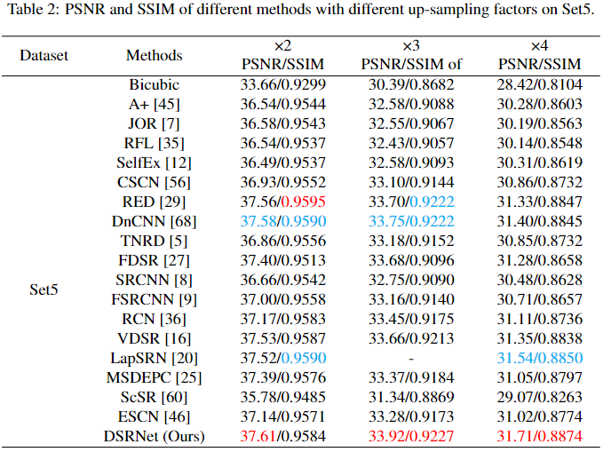
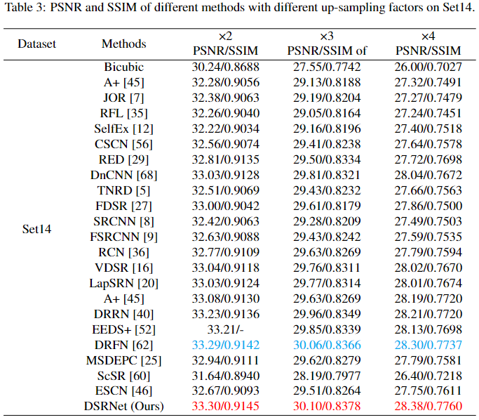
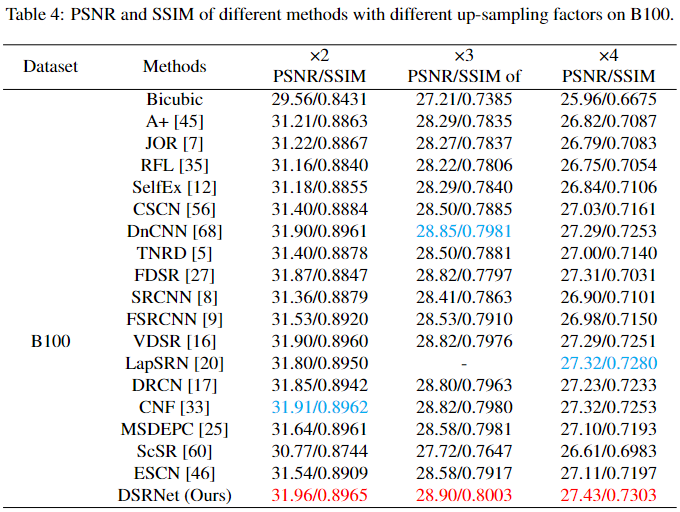
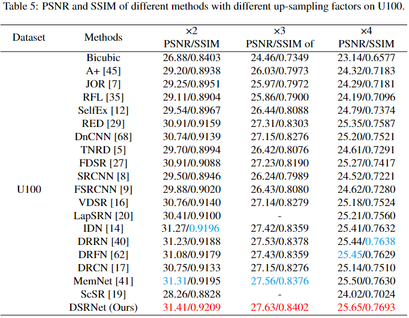
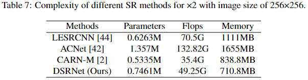

# DSRNet
## Image super-resolution via dynamic network (DSRNet) is conducted by Chunwei Tian, Xuanyu Zhang, Qi Zhang, Mingming Yang and Zhaojie Ju, and accepted by CAAI Transactions on Intelligence Technology (IF:5.1) in 2023. It is implemented by Pytorch. 

### Abstract
#### Convolutional neural networks (CNNs) depend on deep network architectures to extract accurate information for image super-resolution. However, obtained information of these CNNs cannot completely express predicted high-quality images for complex scenes. In this paper, we present a dynamic network for image super-resolution (DSRNet), which contains a residual enhancement block, wide enhancement block, feature refinement block and construction block. The residual enhancement block is composed of a residual enhanced architecture to facilitate hierarchical features for image super-resolution. To enhance robustness of obtained super-resolution model for complex scenes, a wide enhancement block achieves a dynamic architecture to learn more robust information to enhance applicability of an obtained super-resolution model for varying scenes. To prevent interference of components in a wide enhancement block, a refinement block utilizes a stacked architecture to accurately learn obtained features. Also, a residual learning operation is embedded in the refinement block to prevent long-term dependency problem. Finally, a construction block is responsible for reconstructing high-quality images. Designed heterogeneous architecture can not only facilitate richer structural information, but also be lightweight, which is suitable for mobile digital devices. Experimental results shows that our method is more competitive in terms of performance and recovering time of image super-resolution and complexity. 

## Requirements (Pytorch)  
#### Pytorch 1.13.1

#### Python 3.8

#### torchvision

#### openCv for Python

#### HDF5 for Python

#### Numpy, Scipy

#### Pillow, Scikit-image

#### importlib

## Commands
### Training datasets

#### The training dataset is downloaded at https://data.vision.ee.ethz.ch/cvl/DIV2K/

### Test datasets

#### The test dataset of Set5 is downloaded at 链接：https://pan.baidu.com/s/1YqoDHEb-03f-AhPIpEHDPQ (secret code：atwu) (baiduyun) or https://drive.google.com/file/d/1hlwSX0KSbj-V841eESlttoe9Ew7r-Iih/view?usp=sharing (google drive)

#### The test dataset of Set14 is downloaded at 链接：https://pan.baidu.com/s/1GnGD9elL0pxakS6XJmj4tA (secret code：vsks) (baiduyun) or https://drive.google.com/file/d/1us_0sLBFxFZe92wzIN-r79QZ9LINrxPf/view?usp=sharing (google drive)

#### The test dataset of B100 is downloaded at 链接：https://pan.baidu.com/s/1GV99jmj2wrEEAQFHSi8jWw （secret code：fhs2) (baiduyun) or https://drive.google.com/file/d/1G8FCPxPEVzaBcZ6B-w-7Mk8re2WwUZKl/view?usp=sharing (google drive)

#### The test dataset of Urban100 is downloaded at 链接：https://pan.baidu.com/s/15k55SkO6H6A7zHofgHk9fw (secret code：2hny) (baiduyun) or https://drive.google.com/file/d/1yArL2Wh79Hy2i7_YZ8y5mcdAkFTK5HOU/view?usp=sharing (google drive)

#### The test dataset of DIV2K is downloaded at 链接：https://data.vision.ee.ethz.ch/cvl/DIV2K/

### preprocessing

### cd dataset

### python div2h5.py

### Training a model for single scale

#### x2
#### python x2/train.py --patch_size 64 --batch_size 64 --max_steps 600000 --decay 400000 --model dsrnet --ckpt_name dsrnet_x2 --ckpt_dir checkpoint/dsrnet_x2 --scale 2 --num_gpu 1
#### x3
#### python x3/train.py --patch_size 64 --batch_size 64 --max_steps 600000 --decay 400000 --model dsrnet --ckpt_name dsrnet_x3 --ckpt_dir checkpoint/dsrnet_x3 --scale 3 --num_gpu 1
#### x4
#### python x4/train.py --patch_size 64 --batch_size 64 --max_steps 600000 --decay 400000 --model dsrnet --ckpt_name dsrnet_x4 --ckpt_dir checkpoint/dsrnet_x4 --scale 4 --num_gpu 1

### Test with your own parameter setting in the sample.py.

#### python sample.py

## 1. Network architecture of DSRNet

## 2. DSRNet for x2，x3 and x4 on Set5

## 3. DSRNet for x2，x3 and x4 on Set14

## 4. DSRNet for x2，x3 and x4  on B100

## 5. DSRNet for x2，x3 and x4  on U100

## 6. Running time of different methods on hr images of size 256x256, 512x512 and 1024x1024 for x4.

## 7. Complexities of different methods for x4.

## 8. Visual results of U100 for x2.

## 9. Visual results of B100 for x4.

## If you cite this paper, plesae the follow format:

### 1. Tian, C., Zhang, X., Zhang, Q., Yang, M., & Ju, Z. (2023). Image super-resolution via dynamic network. arXiv preprint arXiv:2310.10413.
### 2. @article{tian2023image,
  ### title={Image super-resolution via dynamic network},
  ### author={Tian, Chunwei and Zhang, Xuanyu and Zhang, Qi and Yang, Mingming and Ju, Zhaojie},
  ### journal={arXiv preprint arXiv:2310.10413},
  ### year={2023}
### }
